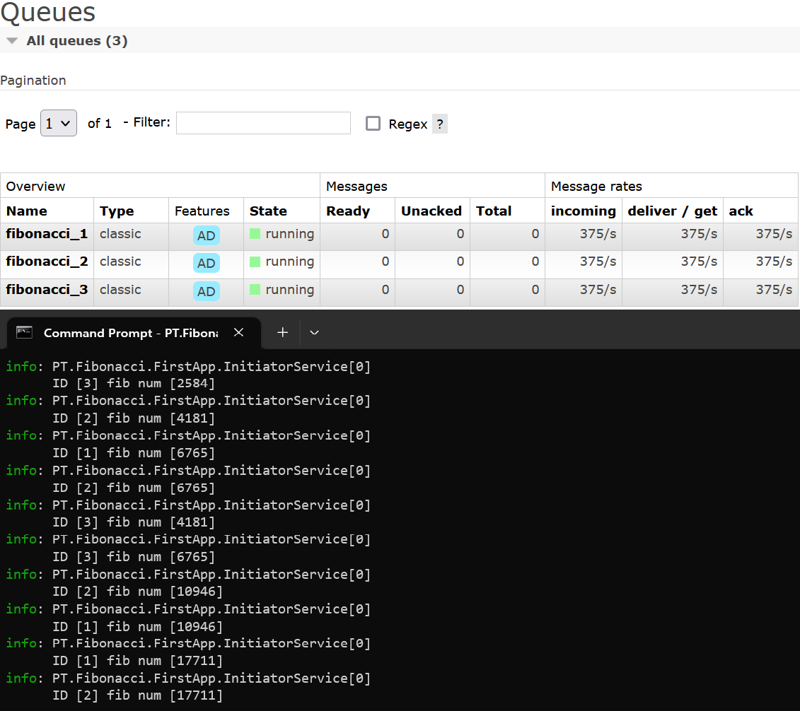

# Fibonacci

Два приложения общаются друг с другом через транспорт, реализуя расчет чисел Фибоначчи.

## Запуск расчетов

1. Запустить контейнер с RabbitMQ с помощью скрипта `.\Docker\RabbitMQ\up.cmd`
2. Задать число параллельных расчетов через параметр `parallelCalcCount` в файле `settings.conf` первого приложения
3. Запустить второе приложение `PT.Fibonacci.SecondApp`
4. Запустить первое приложение `PT.Fibonacci.FirstApp`
5. Для остановки расчетов нажать `Enter` в первом приложении

## Дисклеймер
Для корректной работы обязательно произвести запуск по вышеуказанному порядку.
Для повторного расчета необходимо остановить приложения и снова запустить сначала второе приложение, а затем - первое.
Отсутствуют проверки переполнения для арифметических операций при расчете чисел Фибоначчи.
Обрабатываются не все исключительные ситуации при работе приложений.

## Пример работы приложений для 3 параллельных вычислений

